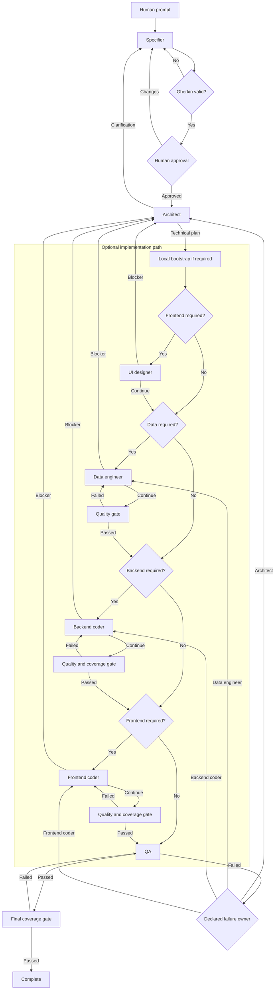

# Web App Dev Team

Seven Codex roles build internal business applications. The orchestrator uses
validated and deterministic handoffs.

```text
specifier -> human review -> architect
architect -> [ui-designer] -> [data-engineer] -> [backend-coder] -> [frontend-coder] -> QA
```

Square brackets identify optional roles. The architect sets `dataRequired`,
`backendRequired`, and `frontendRequired`. The orchestrator calculates the
route.

QA is the only role that can complete a run. QA sends each failure to one
specified owner.

For a new project, a local bootstrap creates the fixed project files. It does
not replace files in an existing project. It installs the dependencies and runs
the initial checks before a specialist starts.



A specialist can send a technical conflict to the architect. The architect
then changes the technical plan.

## Product conventions

```text
src/
  contexts/<context>/{application,domain,infrastructure}
  apps/<application-name>/{backend,frontend}
test/                         # Has the same structure as src/
drizzle/                      # Contains committed SQL migrations
.data/                        # Contains ignored SQLite files
```

The fixed stack uses TypeScript, Bun, tRPC, Zod, OpenAPI, Swagger UI, Drizzle,
`bun:sqlite`, React, Vite, TanStack Router, TanStack Query, Tailwind, shadcn/ui,
and Playwright. See the [stack catalog](./assets/workspace/stack.json) for the
pinned versions.

The internal API uses `@trpc/openapi`. Do not use this API as a public
compatibility contract.

## Requirements and run

Install Bun, tmux, and an authenticated `codex` CLI. If tmux is not available,
the application stops before it changes the target project.

```bash
bun run start -- \
  --workspace /absolute/path/to/project \
  --prompt "Add approval rules to purchase orders"
```

Use `--detach` to keep the tmux session in the background. The tmux window shows
the seven role logs. The specifier waits for `a` to approve or `c` to request
changes.

The application stores runs in
`<workspace>/.web-app-dev-team/runs/<run-id>/`.

## Specifications and restitution

After human approval, the application adds an immutable Gherkin file and hash
to `specifications/manifest.json`.

Restitution implements the specifications in creation order. It does not use
the specifier or human review. It records a checkpoint only after QA completes.

```bash
bun run restore -- \
  --workspace /absolute/path/to/fresh-project \
  --specs-path /absolute/path/to/specifications

bun run restore:resume -- --restore-dir /absolute/path/to/restitution-run
bun run restore:status -- --restore-dir /absolute/path/to/restitution-run
```

Use `--max-turns 24` with `restore:resume` to increase an exhausted turn limit.

## Configuration

```dotenv
WEB_APP_DEV_TEAM_MODEL=gpt-5.6-sol
WEB_APP_DEV_TEAM_MAX_TURNS=12
WEB_APP_DEV_TEAM_MAX_COMPLEXITY=10
WEB_APP_DEV_TEAM_ARCHITECTURE_GUARD=on
```

The turn-limit precedence is
`--max-turns > WEB_APP_DEV_TEAM_MAX_TURNS > 12`.

One turn is one accepted agent execution. A skipped role does not use a turn.
Each restitution specification has a separate turn limit. A CLI option does not
change `.env`.

Before QA, the checks examine structure and complexity. They also run the
available format, lint, typecheck, unit, integration, and E2E scripts.

The controller runs `test:coverage` after backend and frontend work. It runs
the script again after QA requests completion. A failure returns work to the
role that ran the check.

New applications define the coverage limits in `bunfig.toml`. The default
limits are 80 percent for lines, functions, and statements. Browser E2E tests
do not replace unit or integration coverage.

A failed check returns the work to the active role.

## Continuous integration

The new-project bootstrap creates `.github/workflows/ci.yml`. The workflow runs
for pull requests and pushes to `main`.

It installs the pinned Bun version and uses the Bun cache. It then checks
formatting, lint rules, types, and tests. A frontend project also runs Playwright
with Chromium.

The workflow uses read-only repository permissions. It cancels an older run for
the same branch.

## Git workflow

The local Git controller uses a fixed workflow. Agents do not run Git commands.
This workflow applies to delivery runs. Restitution keeps its existing
checkpoint workflow and does not run these Git operations.

At startup, the controller completes these steps:

1. Verify that the workspace is the Git repository root.
2. Verify that the working tree is clean.
3. Fetch the configured base branch.
4. Switch to the base branch.
5. Apply a fast-forward update only.

After specification approval, it creates `feat/<featureId>`. It adds a short run
ID when the branch name already exists.

After QA completes, it stages the project changes. It excludes
`.web-app-dev-team`. It then creates this Conventional Commit:

```text
feat: implement <featureId>
```

The controller pushes the branch to the configured remote. It never uses
`reset --hard`, deletes a branch, or removes project files.

Set the Git configuration in the root `.env` file:

```dotenv
WEB_APP_DEV_TEAM_GIT_WORKFLOW=auto
WEB_APP_DEV_TEAM_GIT_REMOTE=origin
WEB_APP_DEV_TEAM_GIT_BASE_BRANCH=main
```

Use `on` to require a Git repository. Use `off` to disable the workflow. Use
`auto` to skip Git for a workspace that is not a Git repository.

If branch creation or final delivery fails, the run state records the step and
error. Correct the external problem, and retry the step:

```bash
bun run git:resume -- --run-dir /absolute/path/to/run
```

## Pull request creation

The controller can create a pull request through the official GitHub MCP
server. Install and authenticate the local `github-mcp-server`. Enable only its
`create_pull_request` tool.

```dotenv
WEB_APP_DEV_TEAM_CREATE_PR=on
WEB_APP_DEV_TEAM_GITHUB_MCP_COMMAND=github-mcp-server
WEB_APP_DEV_TEAM_GITHUB_MCP_ARGS=["stdio","--tools=create_pull_request"]
GITHUB_PERSONAL_ACCESS_TOKEN=github_pat_...
```

The controller reads
[the pull request template](./assets/git/pull-request.md).
It fills the template with the feature ID, role summaries, QA evidence, and
local-check evidence. It does not use an agent call to create this text.

## Code structure

```text
assets/                 # Agent rules, schemas, stack data, and templates
src/domain/             # Workflow values, states, and validation rules
src/application/        # Use cases and ports
src/infrastructure/     # File, Git, agent, terminal, and quality adapters
src/apps/cli/           # CLI entry point and terminal interaction
test/                   # Has the same structure as src/
```

The domain does not depend on the application or infrastructure. The
application uses ports and does not depend on infrastructure adapters. The CLI
is the composition root. Architecture tests enforce these rules.

## Customize and verify

See the [asset configuration guide](./assets/README.md) for supported changes
and source code boundaries.

```bash
bun run demo
bun run check
```
