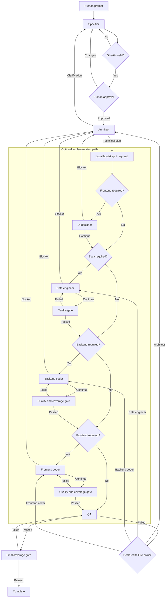

# Web App Dev Team

Web App Dev Team uses seven specialized Codex roles to build web
applications.

It turns one feature request into an approved specification,
implementation, tests, and an optional pull request.

## Install

The package supports macOS and Linux.

It requires Bun, tmux, Git, an authenticated Codex CLI, and
`github-mcp-server`.

Install the current stable version:

```bash
npm install --global @hagioscopio/web-app-dev-team
```

Install the current test version:

```bash
npm install --global @hagioscopio/web-app-dev-team@next
```

Create the user configuration:

```bash
web-app-dev-team configure
```

The command requests the GitHub token without showing it. It creates the
configuration directory with mode `700`. It creates `config.env` with mode
`600`. It also requests the model, turn limit, complexity limit, and
architecture guard setting. Press Enter to use each default value.

The command also checks the GitHub MCP server. If it is missing, the command
offers to install it. It uses Homebrew on macOS. It installs the official
binary in `~/.local/bin` on Linux. The Linux installation does not use `sudo`.
You can decline the installation. The command then shows the manual
installation link.

The GitHub MCP server is required on macOS and Linux. You can also install it
manually.

On macOS, install it with Homebrew:

```bash
brew install github-mcp-server
```

On Linux, get the GitHub MCP server from the
[official releases](https://github.com/github/github-mcp-server/releases).

Use a fine-grained personal access token. Give it access to each target
repository. Set the `Pull requests` repository permission to `Read and write`.
Do not put the token in shell history or commit it to Git.

Check the configured system:

```bash
web-app-dev-team doctor
```

## Quick start

Run one feature request against a project:

```bash
web-app-dev-team run \
  --workspace /absolute/path/to/project \
  --prompt "Add approval rules to purchase orders"
```

The `--workspace` option is required. The command never uses the current
directory as an implicit workspace.

The specifier shows a Gherkin specification before implementation starts.
Enter `a` to approve it. Enter `c` to request changes.

Use `--detach` to run the tmux session in the background:

```bash
web-app-dev-team run \
  --workspace /absolute/path/to/project \
  --prompt "Add approval rules to purchase orders" \
  --detach
```

The command prints the tmux session name. Use that name with `attach`.

## Commands

### `configure`

Create secure user configuration and validate GitHub MCP access:

```bash
web-app-dev-team configure
```

The command keeps an existing token unless you approve its replacement. It
explains each runtime setting and offers its current or default value. It asks
before it installs the GitHub MCP server. You can install the server later.

### `doctor`

Check the platform and required commands:

```bash
web-app-dev-team doctor
```

Add a workspace to check its access and Git repository:

```bash
web-app-dev-team doctor --workspace /absolute/path/to/project
```

The result uses `PASS`, `WARNING`, and `FAIL`. A blocking failure returns a
nonzero exit code.

### `run`

Start a development run for one feature request:

```bash
web-app-dev-team run \
  --workspace /absolute/path/to/project \
  --prompt "Add approval rules to purchase orders"
```

The workspace can be an empty directory for a new application. It can also be
an existing project directory.

The command prepares Git, creates the specification, requests human approval,
and routes the approved work through the required roles. QA is the only role
that can complete the run.

Run data is stored in:

```text
<workspace>/.web-app-dev-team/runs/<run-id>/
```

### `restore`

Rebuild a fresh project from previously approved specifications:

```bash
web-app-dev-team restore \
  --workspace /absolute/path/to/fresh-project \
  --specs-path /absolute/path/to/specifications
```

The command verifies the specification hashes and implements each
specification in sequence. It does not run the specifier or request another
human approval. It records a checkpoint after QA completes each specification.

Restitution data is stored in:

```text
<workspace>/.web-app-dev-team/restitutions/<restore-id>/
```

### `restore:resume`

Continue a restitution after an interruption, failure, or turn limit:

```bash
web-app-dev-team restore:resume \
  --restore-dir /absolute/path/to/restitution-run
```

Use a larger turn limit when the current specification needs more work:

```bash
web-app-dev-team restore:resume \
  --restore-dir /absolute/path/to/restitution-run \
  --max-turns 24
```

The command keeps completed specifications, checkpoints, token totals, and the
current agent.

### `restore:status`

Show restitution progress without changing it:

```bash
web-app-dev-team restore:status \
  --restore-dir /absolute/path/to/restitution-run
```

The output shows the overall state, completed specifications, current
sequence, current agent, last failure, token totals, and progress log.

### `attach`

Open a tmux session that was started with `--detach`:

```bash
web-app-dev-team attach \
  --session web-app-dev-team-123456789
```

Use the session name printed by `run` or `restore`.

### `git-resume`

Retry a failed Git delivery step:

```bash
web-app-dev-team git-resume \
  --run-dir /absolute/path/to/run
```

Use this command after a branch, commit, push, or pull request failure. It uses
the saved run state. It does not repeat agent work when only Git delivery
remains.

### Help and version

```bash
web-app-dev-team --help
web-app-dev-team --version
```

## Configuration

The command uses this configuration order:

1. Command options.
2. Environment variables.
3. `<workspace>/.web-app-dev-team/config.env`.
4. `~/.config/web-app-dev-team/config.env`.
5. Default values.

Common values:

```dotenv
WEB_APP_DEV_TEAM_MODEL=gpt-5.6-luna
WEB_APP_DEV_TEAM_MAX_TURNS=12
WEB_APP_DEV_TEAM_MAX_COMPLEXITY=10
WEB_APP_DEV_TEAM_ARCHITECTURE_GUARD=on
WEB_APP_DEV_TEAM_GIT_WORKFLOW=auto
WEB_APP_DEV_TEAM_GIT_REMOTE=origin
WEB_APP_DEV_TEAM_GIT_BASE_BRANCH=main
WEB_APP_DEV_TEAM_CREATE_PR=on
WEB_APP_DEV_TEAM_GITHUB_MCP_COMMAND=github-mcp-server
WEB_APP_DEV_TEAM_GITHUB_MCP_ARGS=["stdio","--tools=create_pull_request"]
GITHUB_PERSONAL_ACCESS_TOKEN=github_pat_...
```

Pull request creation is enabled by default. Set
`WEB_APP_DEV_TEAM_CREATE_PR=off` to disable it. When it is enabled, startup
connects to the GitHub MCP server and requires its `create_pull_request` tool.

Use a fine-grained personal access token for
`GITHUB_PERSONAL_ACCESS_TOKEN`. Configure the token as follows:

1. Select the owner of the target repository as the resource owner.
2. Grant access to each target repository.
3. Set the `Pull requests` repository permission to `Read and write`.

GitHub grants the required `Metadata` read permission automatically. An
organization can require token approval. The token cannot create pull requests
for that organization until an administrator approves it.

Create the token in
[GitHub fine-grained personal access tokens](https://github.com/settings/personal-access-tokens/new).
GitHub documents the required permission in
[Create a pull request](https://docs.github.com/en/rest/pulls/pulls#create-a-pull-request).

Do not commit secrets from a configuration file.

## Update and remove

Update the stable version:

```bash
npm install --global @hagioscopio/web-app-dev-team@latest
```

Remove the command:

```bash
npm uninstall --global @hagioscopio/web-app-dev-team
```

## Developers

The following sections describe repository development and internal behavior.

### Local setup

Install Bun, tmux, Git, an authenticated `codex` CLI, and
`github-mcp-server`. Install the repository dependencies:

```bash
bun install --frozen-lockfile
```

Run the local CLI:

```bash
bun run start -- \
  --workspace /absolute/path/to/project \
  --prompt "Add approval rules to purchase orders"
```

Run the deterministic demo and all checks:

```bash
bun run demo
bun run check
```

Build and inspect the npm package:

```bash
bun run build
npm run package:inspect
```

### Development workflow

The orchestrator uses validated and deterministic handoffs:

```text
specifier -> human review -> architect
architect -> [ui-designer] -> [data-engineer] -> [backend-coder] -> [frontend-coder] -> QA
```

Square brackets identify optional roles. The architect sets `dataRequired`,
`backendRequired`, and `frontendRequired`. The orchestrator calculates the
route.

QA is the only role that can complete a run. QA sends each failure to one
specified owner.

For a new project, a local bootstrap creates the fixed project files. It does
not replace files in an existing project. It installs dependencies and runs
the initial checks before a specialist starts.



A specialist can send a technical conflict to the architect. The architect
then changes the technical plan.

### Product conventions

```text
src/
  contexts/<context>/{application,domain,infrastructure}
  apps/<application-name>/{backend,frontend}
test/                         # Has the same structure as src/
drizzle/                      # Contains committed SQL migrations
.data/                        # Contains ignored SQLite files
```

The fixed stack uses TypeScript, Bun, tRPC, Zod, OpenAPI, Swagger UI, Drizzle,
`bun:sqlite`, React, Vite, TanStack Router, TanStack Query, Tailwind, shadcn/ui,
and Playwright. See the [stack catalog](./assets/workspace/stack.json) for the
pinned versions.

The internal API uses `@trpc/openapi`. Do not use this API as a public
compatibility contract.

### Specifications and restitution

After human approval, the application adds an immutable Gherkin file and hash
to `specifications/manifest.json`.

Restitution implements specifications in creation order. It records a
checkpoint only after QA completes.

Use the local scripts during repository development:

```bash
bun run restore -- \
  --workspace /absolute/path/to/fresh-project \
  --specs-path /absolute/path/to/specifications

bun run restore:resume -- --restore-dir /absolute/path/to/restitution-run
bun run restore:status -- --restore-dir /absolute/path/to/restitution-run
```

Each restitution specification has a separate turn limit. A skipped role does
not use a turn.

### Quality gates

Before QA, the checks examine structure and complexity. They also run the
available format, lint, typecheck, unit, integration, and E2E scripts.

The controller runs `test:coverage` after backend and frontend work. It runs
the script again after QA requests completion. A failure returns work to the
role that ran the check.

New applications define coverage limits in `bunfig.toml`. The default limits
are 80 percent for lines, functions, and statements. Browser E2E tests do not
replace unit or integration coverage.

### Generated continuous integration

The new-project bootstrap creates `.github/workflows/ci.yml`. The workflow runs
for pull requests and pushes to `main`.

It installs the pinned Bun version and uses the Bun cache. It then checks
formatting, lint rules, types, and tests. A frontend project also runs
Playwright with Chromium.

The workflow uses read-only repository permissions. It cancels an older run
for the same branch.

### Git workflow

The local Git controller uses a fixed workflow. Agents do not run Git commands.
This workflow applies to delivery runs. Restitution keeps its checkpoint
workflow and does not run these Git operations.

At startup, the controller completes these steps:

1. Verify that the workspace is the Git repository root.
2. Verify that the working tree is clean.
3. Fetch the configured base branch.
4. Switch to the base branch.
5. Apply a fast-forward update only.

After specification approval, it creates `feat/<featureId>`. It adds a short run
ID when the branch name already exists.

After QA completes, it stages the project changes. It excludes
`.web-app-dev-team`. It then creates this Conventional Commit:

```text
feat: implement <featureId>
```

The controller pushes the branch to the configured remote. It never uses
`reset --hard`, deletes a branch, or removes project files.

Use `on` to require a Git repository. Use `off` to disable the workflow. Use
`auto` to skip Git for a workspace that is not a Git repository.

### Pull request creation

The controller can create a pull request through the official GitHub MCP
server. Install and authenticate the local `github-mcp-server`. Enable only its
`create_pull_request` tool.

```dotenv
WEB_APP_DEV_TEAM_CREATE_PR=on
WEB_APP_DEV_TEAM_GITHUB_MCP_COMMAND=github-mcp-server
WEB_APP_DEV_TEAM_GITHUB_MCP_ARGS=["stdio","--tools=create_pull_request"]
GITHUB_PERSONAL_ACCESS_TOKEN=github_pat_...
```

Use a fine-grained token. Give it access to the target repositories. Set the
`Pull requests` repository permission to `Read and write`. Do not give the token
more access than this tool needs.

The controller reads
[the pull request template](./assets/git/pull-request.md). It fills the template
with the feature ID, role summaries, QA evidence, and local-check evidence. It
does not use an agent call to create this text.

### npm package release

The package contains the compiled Bun entry points and required assets. It does
not contain the application TypeScript source or tests.

Pull requests and changes to `main` run CI.

Start the `Publish npm package`

Action manually when the current `main` commit is ready for publication.
Enter the exact semantic version, such as `0.1.0-beta.3` or `0.1.0`.

The version must be equal to or greater than the current `package.json`
version. A patch version, such as `0.1.1`, is greater than `0.1.0`. Use an equal
version only to retry an incomplete release.

The Action updates `package.json`. It runs all checks and builds the package. It
commits the version, creates the Git tag, publishes to npm, and creates the
GitHub Release. A version with a prerelease suffix uses the npm `next` tag. A
stable version uses the npm `latest` tag.

The Action supports safe retries. It skips an npm version that it already
published. It also skips an existing GitHub Release.

Build and test a local archive:

```bash
bun run check
bun run build
npm run package:create
```

Configure npm Trusted Publishing with the GitHub owner, repository,
`publish-npm.yml` workflow name, and `npm` environment. Permit `npm publish`.
The workflow needs permission to write repository contents. Repository rules
must permit its release commit and tag.

### Code structure

```text
assets/                 # Agent rules, schemas, stack data, and templates
src/domain/             # Workflow values, states, and validation rules
src/application/        # Use cases and ports
src/infrastructure/     # File, Git, agent, terminal, and quality adapters
src/apps/cli/           # CLI entry point and terminal interaction
test/                   # Has the same structure as src/
```

The domain does not depend on the application or infrastructure. The
application uses ports and does not depend on infrastructure adapters. The CLI
is the composition root. Architecture tests enforce these rules.

### Customize and verify

See the [asset configuration guide](./assets/README.md) for supported changes
and source code boundaries.

```bash
bun run demo
bun run check
```
